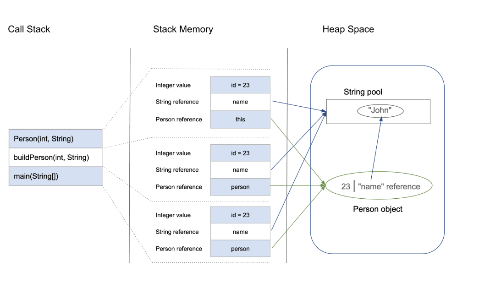

``` 
class Person {
    int id;
    String name;

    public Person(int id, String name) {
        this.id = id;
        this.name = name;
    }
}

public class PersonBuilder {
    private static Person buildPerson(int id, String name) {
        return new Person(id, name);
    }

    public static void main(String[] args) {
        int id = 23;
        String name = "John";
        Person person = null;
        person = buildPerson(id, name);
    }
}
```

Let’s analyze this step-by-step:

1. When we enter the main() method, a space in stack memory is created to store primitives and references of this method.
   - Stack memory directly stores the primitive value of the integer id.
   - The reference variable person of type Person will also be created in stack memory, initially pointing to null and later updated to point to the actual object in the heap.
2. The main method is calling the buildPerson() static method, for which allocation will take place in stack memory on top of the previous one.
3. The buildPerson() calls the parameterized constructor Person(int, String) which will allocate further memory on top of the previous stack. This will store:
   - The this object reference of the calling object in stack memory
   - The primitive value id in the stack memory
   - The reference variable of String argument name, which will point to the actual string from string pool in heap memory
4. However, heap memory will store all instance variables for the newly created object person of type Person.

### Allocation diagram
