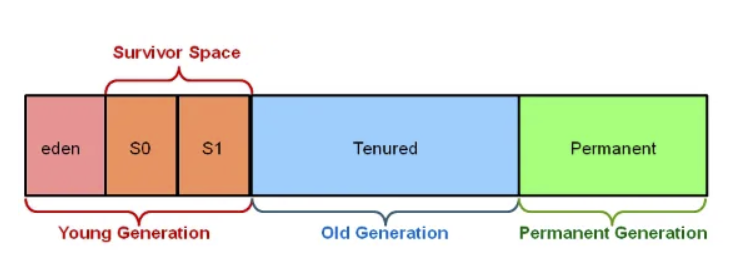

### Heap memory (Dynamic memory allocation of Java objects and JRE classes at runtime)
1. **Definition**:
   - #### The heap is a part in memory that is shared by all threads of a process.
   - The heap is a critical component of Java’s memory model, serving as the primary area for storing Java objects. Whenever an object is created using the new keyword in Java, memory for that object is allocated from the heap. This is also where the Garbage Collector operates, reclaiming memory used by objects that are no longer needed, which helps prevent memory leaks and excessive memory usage.
2. **Structure of heap memory**:
   1. Young generation
      - This is where all new objects are allocated. The Young Generation is further divided into one ‘Eden’ space and two ‘Survivor’ spaces. Objects initially reside in Eden and move to a Survivor space if they remain alive after a garbage collection event.
   2. Old generation
      - Objects that have survived several garbage collection cycles in the Young Generation are promoted to the Old Generation. It is designed for objects with a longer lifecycle. The threshold of survival is set by the garbage collector’s policies and can be tuned by the developer.
   3. Permanent generation (only in JVM's before java 8) / Replaced by Metaspace memory
      - This is where Java keeps information about classes and methods, check: [Metaspace](../metaspace/Metaspace.md)
3. **Key features of Heap memory**
   - It’s accessed via complex memory management techniques that include the Young Generation, Old or Tenured Generation, and Permanent Generation.
   - If heap space is full, Java throws java.lang.OutOfMemoryError.
   - Access to this memory is comparatively slower than stack memory
   - This memory, in contrast to stack, isn’t automatically deallocated. It needs Garbage Collector to free up unused objects so as to keep the efficiency of the memory usage.
   - Unlike stack, a heap isn’t threadsafe and needs to be guarded by properly synchronizing the code.

For more infos : [Click me hh](https://medium.com/@perspectivementor/java-memory-management-and-garbage-collection-fdf227569a61),
[Me too please hh](https://medium.com/@b.stoilov/everything-you-need-to-know-about-the-java-garbage-collector-8537459bf1a2)
## Heap memory diagram:
