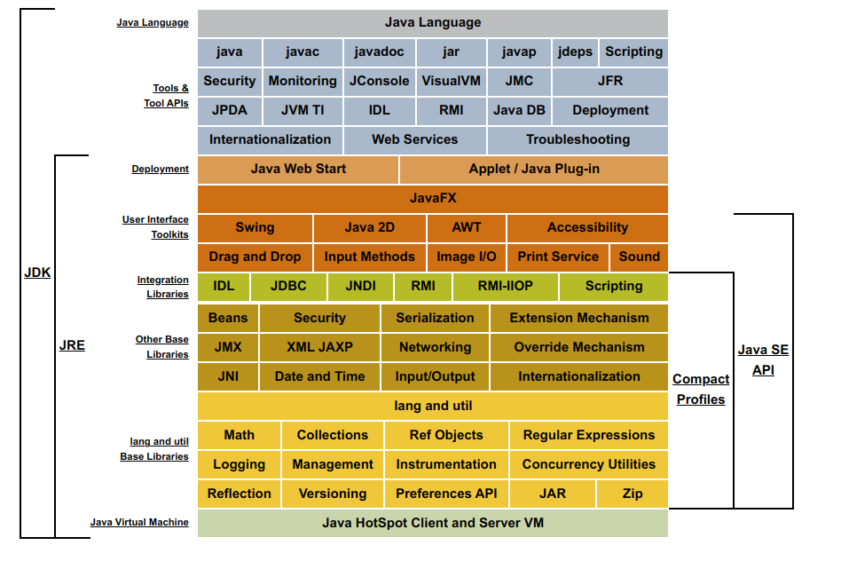

## JDK (Java Development Kit)
  - It is used to build and develop the java program
  - It internally contains JRE
  - It contains the compiler and debugger
  - It contains all the related set of libraries and files to build and compile the java program
  - Without JDK we can’t build any java program
### JDK Architecture

### How JDK works
- Compilation- It consists of a Java compiler (javac) which is responsible for translating the Java code to the byte-code. The bytecode is an intermediate code that is understood by the Java Virtual Machine (JVM).
- Execution- The Java code is executed by the JVM which is a part of JDK.
- Debugging- There might be errors and bugs in our Java code which is debugged using the tools provided by JDK.

## JRE (Java Runtime Environment)
- JRE is the responsible unit to run the java program
- Without JRE we can’t run java program (JDK is used to build java program, where as JRE is used to run java program. Such that without JDK, I mean with only JRE we can run the java program without JDK)
- JRE contains JVM
- JRE contains all the inbuilt packages and library files (lang, io, util, etc. all packages are present in JRE)
## JVM (Java Virtual Machine)
- JVM is platform dependent
- JVM is responsible for converting the byte code to machine code.
- JVM takes (.class) files and executes it by managing the memory
- JVM contains JIT (Just in time compiler)
- JVM loads, verifies and executes the code and provides the runtime environment
- JVM plays a major role in java memory management
It is known as a virtual machine as it is not present physically.